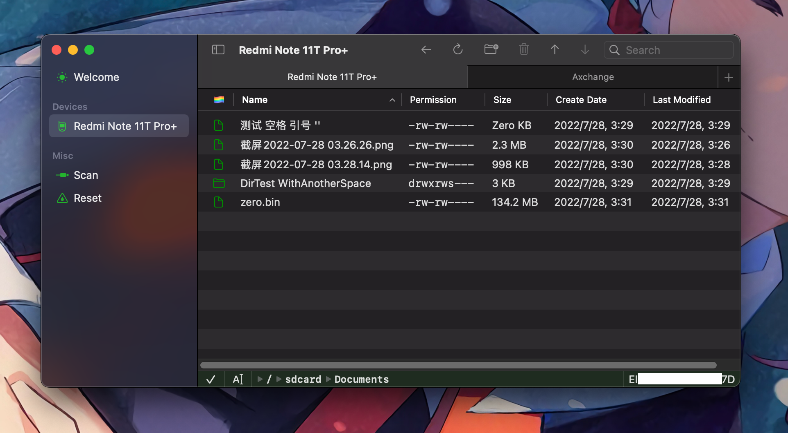

# Axchange

  <a href="README.md">English</a> |
  <a href="./Resources/i18n/zh-Hans/README.md">简体中文</a>

Android file transfer based on ADB made easy.

## Preview

## Key Features

Here’s a checklist of features:

- [x] Download and upload files and directories
- [x] Rename and delete files and directories
- [x] Create, rename, and delete directories
- [x] Space to preview (requires macOS 14.0+)
- [x] Easy navigation, ready to use and reliable
- [x] No hang-up, everything is cancellable
- [x] ADB bundled but also works with your own
- [x] Drop files to your Android device
- [x] Drag files from your Android device (requires v1.3 & macOS 14.0+)

## License

The Axchange is licensed under [MIT License](./LICENSE). It's free if you compile it yourself.

We reserve the right to change the license in the future.

## Privacy Policy

[No data is collected by Axchange](./Resources/Privacy.md) 👍

## Contributor

Made by [@Lakr233](https://twitter.com/Lakr233) for [@lz\_\_\_233](https://twitter.com/lz__233)

Thanks [@unixzii](https://twitter.com/unixzii) for being with me so many times.

---

Copyright © 2024 Lakr Aream. All Rights Reserved.
