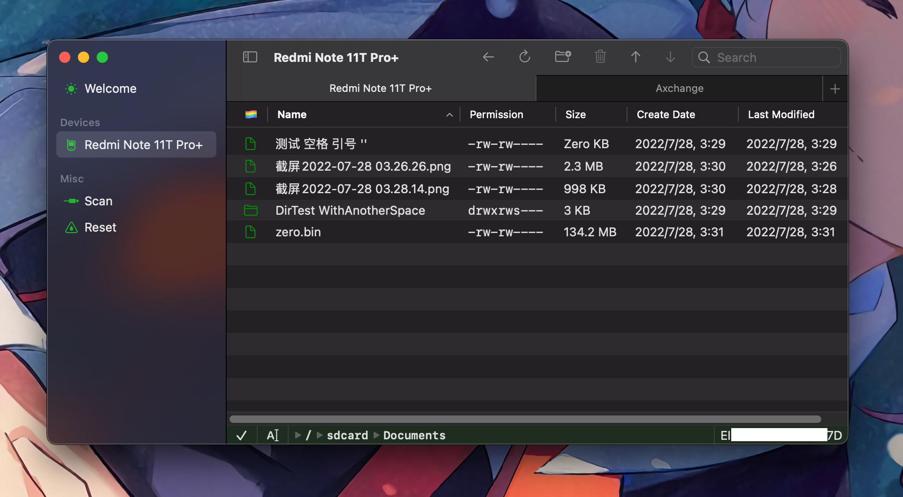

# Axchange

  <a href="README.md">English</a> |
  <a href="./Resources/i18n/zh-Hans/README.md">简体中文</a>

简单来说就是基于 ADB（Android 调试桥）的文件传输工具。

## 预览

## 主要功能

以下是功能清单：

- [x] 下载和上传文件及文件夹
- [x] 重命名和删除文件及文件夹
- [x] 创建、重命名和删除文件夹
- [x] 空格键预览（需要 macOS 14.0+）
- [x] 简单导航，易于使用且可靠
- [x] 无卡顿，所有操作都可取消
- [x] 内置 ADB，若系统已在运行则使用系统提供的 ADB 服务
- [x] 将文件拖入 Android 设备
- [x] 从 Android 设备拖出文件（需要 v1.3 和 macOS 14.0+）

## 许可证

Axchange 的代码遵循 [MIT 许可证](../../../LICENSE)。如果你自行编译，则完全免费。

我们保留在未来更改许可证的权利。

## 隐私政策

[Axchange 不收集任何数据](../../Privacy.md) 👍

## 贡献者

由 [@Lakr233](https://twitter.com/Lakr233) 为 [@lz\_\_\_233](https://twitter.com/lz__233) 制作。

感谢 [@unixzii](https://twitter.com/unixzii) 的多次支持。

---

版权所有 © 2024 砍砍@标准件厂长。保留所有权利。
