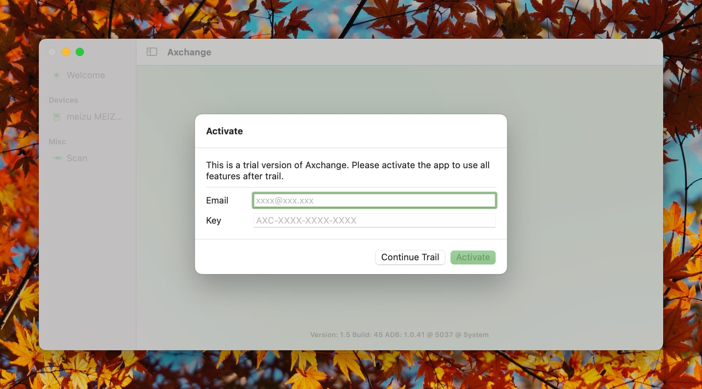
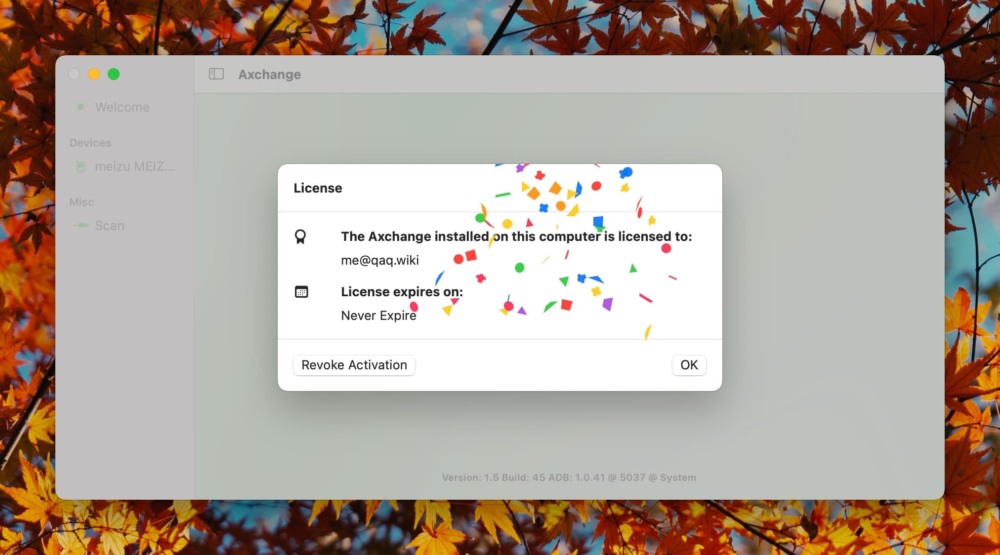

# Software Activation

**Axchange downloaded outside of the App Store requires activation to use.**

If you have purchased Axchange from the App Store, you can skip this section.

## Purchase

There are two ways to obtain a license for Axchange:

- https://www.creem.io/payment/prod_6Bht6EjCLseON5xihxtUzN (visa, mastercard...)
- https://lizhi.shop/site/products/id/791 (wechat, alipay...)

## Trial

You can try Axchange for approximately 7 days before activation. During the trial, you can use all software features without any restrictions. Simply click `Continue Trial` on the activation page.

> **Note:** Altering the system date during the trial period may cause the trial to end prematurely.

## Purchase

You can purchase an activation code from authorized resellers. Please refer to the [Official Partners Page](../lizhi/) for more information.

**Please Note: Once a digital license is used, it is non-refundable.**

## Activation

If you have purchased an activation code, you can activate the software. If the activation page does not open automatically, you can manually open it by selecting `Activate...` from the `License` tab in the menu bar.

Enter your email and activation code on the activation page, then click `Activate` manually. An internet connection is required for activation.

- Once activated, the software can be used offline as long as the `Deactivate` function is not used.

## Deactivation

Deactivation removes the activation code from the current device. Use this function only when selling or no longer using the device.

> **Note:** Deactivation does not lift or extend the activation code's usage limit.

## Activation Code Usage Limits

A single activation code can be used on multiple devices.

**Note:** A single activation code is intended for use on a reasonable number of devices by one user.

Excessive activation requests may result in the activation code being banned. Any bans are subject to manual review and are operated by staff.

`The limit is up to 5 devices per year or 10 activation requests within the same period.`
