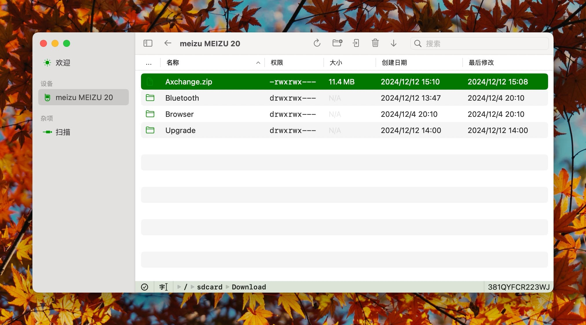
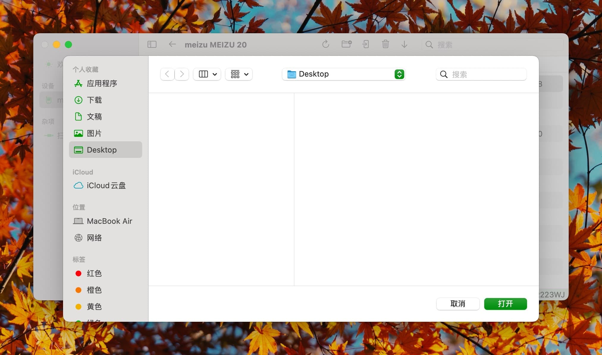

# Download

Click on items in the list to select the target file(s). Hold `⌘` or `⇧` to select multiple items. Once the desired files are selected, the `Download` button in the toolbar will become active.

Click the button to save the files to a specified location.

For multiple selected items, a progress indicator will display during the download process.

## Notes

- Downloading will overwrite existing files and merge with existing folders.
- Downloaded files will use ADB's default file permissions. To preserve file permissions, consider using compressed file formats.
- For multiple selected files, the download order cannot be specified.
