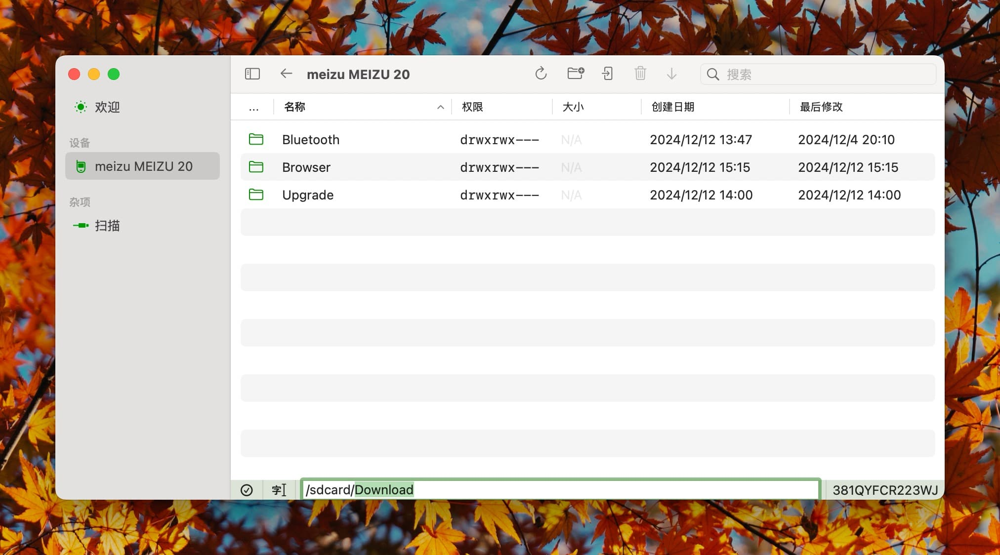

# Navigation

You can enter a folder by double-clicking on it.

## Edit Location

You can enable the location editing feature by clicking the second button in the status bar at the bottom of the device page. Then, you can enter any location and press Enter to switch to the target location.

