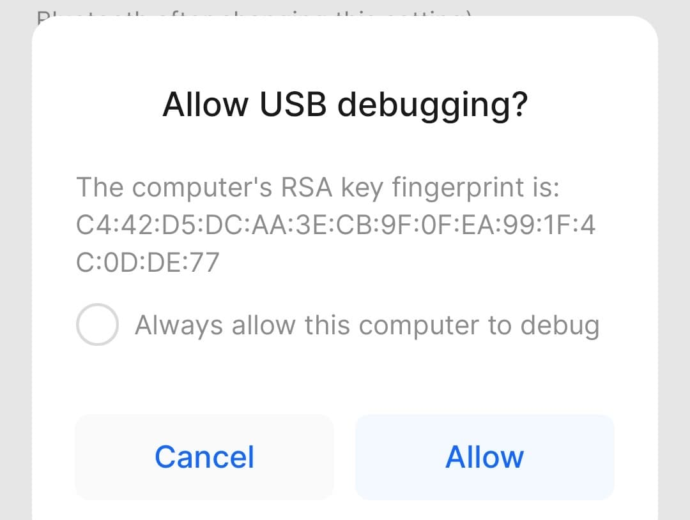
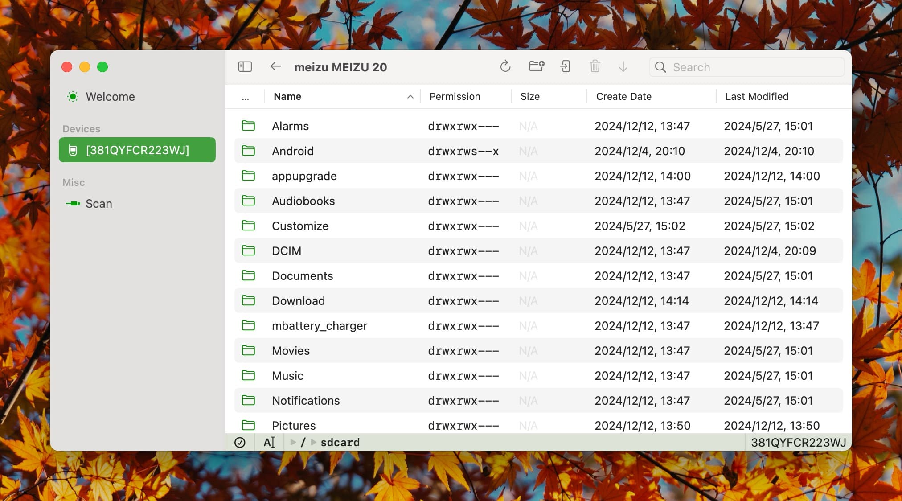

# デバイスでADBを有効にする

## ADBを有効にする

デバイスでADBを有効にする方法については、[Googleのドキュメント](https://developer.android.com/studio/debug/dev-options#enable)を参照してください。

`デバイスでUSBデバッグを有効にする`というセクションをご確認ください。コンピューターからデバイスにアクセスするには、この機能を有効にする必要があります。

## アクセスの許可

通常、デバイスがコンピューターに接続されると、下の画像のように、接続を許可するかどうかを尋ねるダイアログボックスが自動的に表示されます。このダイアログボックスが表示されない場合は、以前に拒否された可能性があります。ほとんどのデバイスでは、デバイスをコンピューターから取り外して再接続すると、認証ダイアログが再度表示されます。

- 一部のデバイスではパスワードの入力が必要な場合があります。デバイスの画面上の指示に従ってください。



この時点で、デバイス上で`常にこのコンピューターからのデバッグを許可する`にチェックを入れ、`OK`をタップすることをお勧めします。その後、コンピューターのAxchangeソフトウェアの左側にある`スキャン`をクリックして、デバイスのステータスを更新します。メニューバーの`デバイス`タブでもこのオプションを見つけることができます。

- 安定性の理由から、Axchangeはデバイスのステータスを**自動的に**更新しません。



## アクセス拒否

Axchangeを実行しているコンピューターがデバイスから信頼されていない場合、以下のようなアクセス拒否プロンプトが表示されます。


## 技術情報

**Axchangeはシステムにインストールされたあらゆるバージョンのアンドロイドデバッグブリッジ(ADB)との互換性があります。**

Axchangeが起動し、ADBクエリに応答するときに、ポート`5037`が別のプログラムによって既に占有されている場合、アプリケーション内のバンドルされたADBサービスは起動しません。そうでない場合は、ポート`5037`でADBサービスを起動しようとします。

その結果、AxchangeはADBサービスに応じて、異なる場所に認証情報を保存します。

アプリケーション内のバンドルされたADBサービスの場合、認証情報は以下の場所にあるアプリケーションのコンテナ内に保存されます：

```
~/Library/Containers/wiki.qaq.Axchange/Data/.android/adbkey
~/Library/Containers/wiki.qaq.Axchange/Data/.android/adbkey.pub
```

コンピューター上で利用可能な他のADBサービスの場合、認証情報は通常、そのADBサービスに対応するホームディレクトリに保存されます：

```
~/.android/adbkey
~/.android/adbkey.pub
```

**いずれの状況でも、デバイスにアクセスするには、デバイス上で認証を許可する必要があります。**
