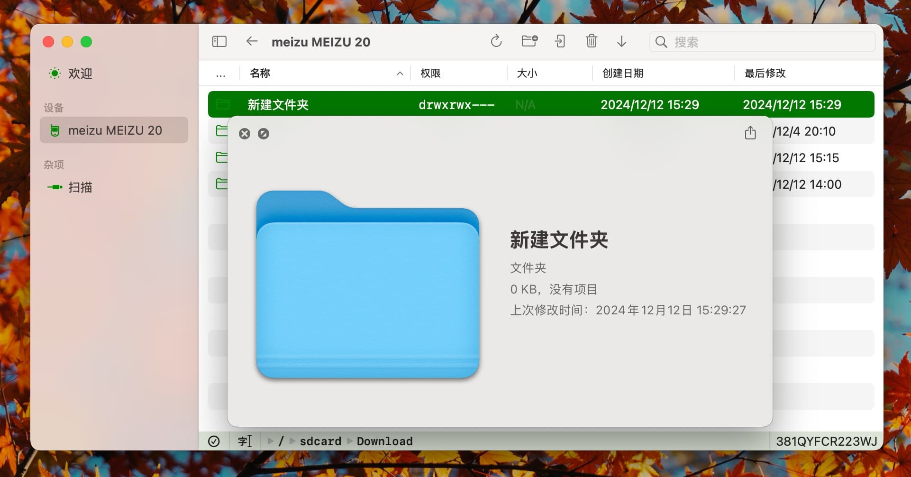

# プレビュー

Finderと同様に、ファイルを選択した後にスペースキーを押すことで、ファイルの内容をプレビューできます。複数のファイルが選択されている場合、最初のファイルのみがプレビューされます。

プレビュー中、対象ファイルは一時フォルダにダウンロードされます。そのため、システムがサポートするあらゆるファイルタイプをプレビューできます。

## 注意事項

- プレビュー機能はダウンロードしたファイルをキャッシュしません。プレビューするたびにファイルが再ダウンロードされます。
- アプリケーションが閉じられると、すべてのプレビューファイルは削除されます。
- この機能にはmacOS 14.0以降が必要です。
