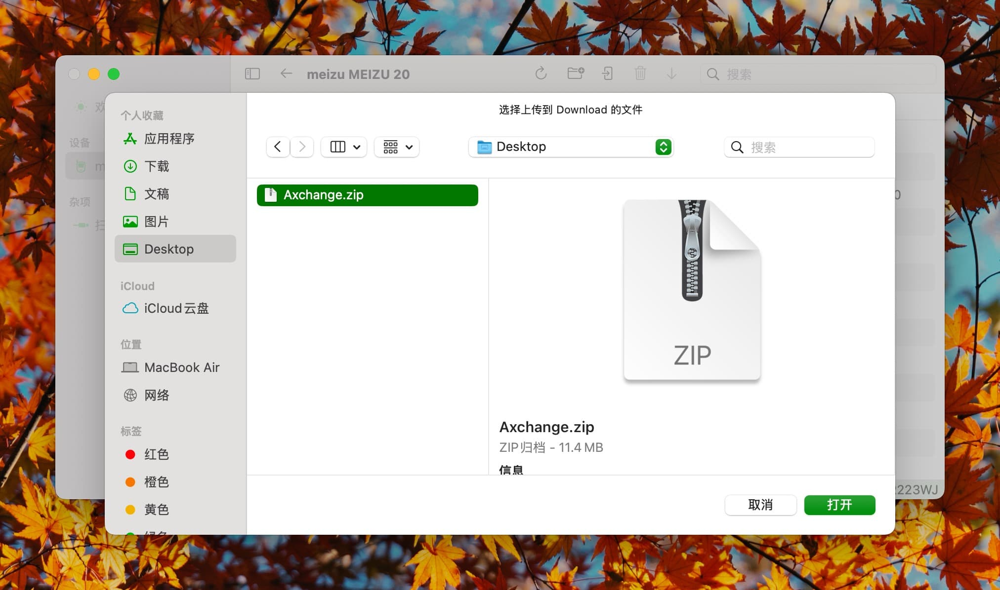
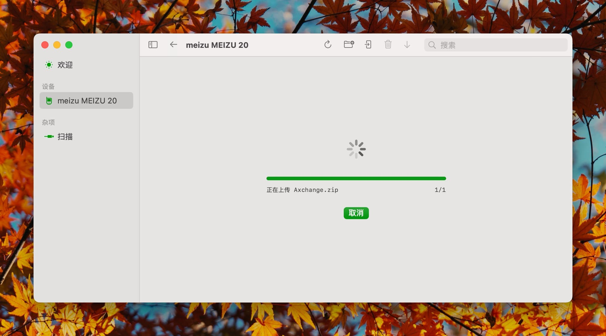

# アップロード

メニューバーの`アップロード`ボタンをクリックし、アップロードしたいファイルを選択してください。アップロード処理はすぐに開始されます。

アップロード処理中、インターフェースが切り替わりアップロード進捗状況が表示されます。複数のファイルが選択されている場合、ファイルは順番にアップロードされ、全体の進捗状況が表示されます。

## 注意事項

- アップロードは既存のファイルを上書きし、既存のフォルダとマージします。
- アップロードされたファイルはADBのデフォルトファイル権限が使用されます。ファイル権限を保持したい場合は、圧縮ファイル形式の使用を検討してください。
- 複数選択されたファイルの場合、アップロード順序を指定することはできません。
