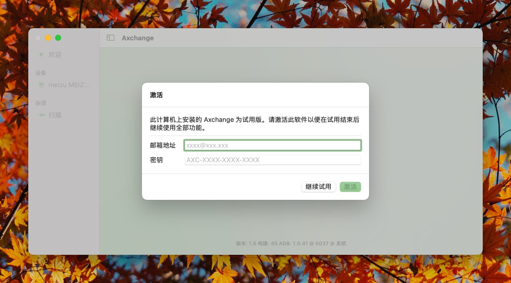
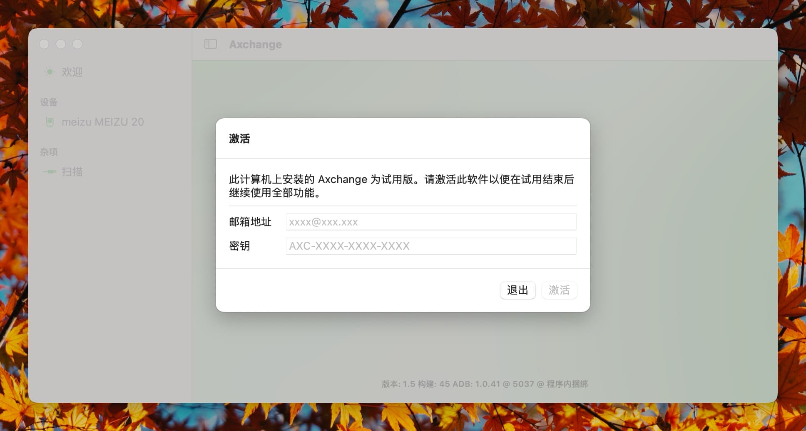
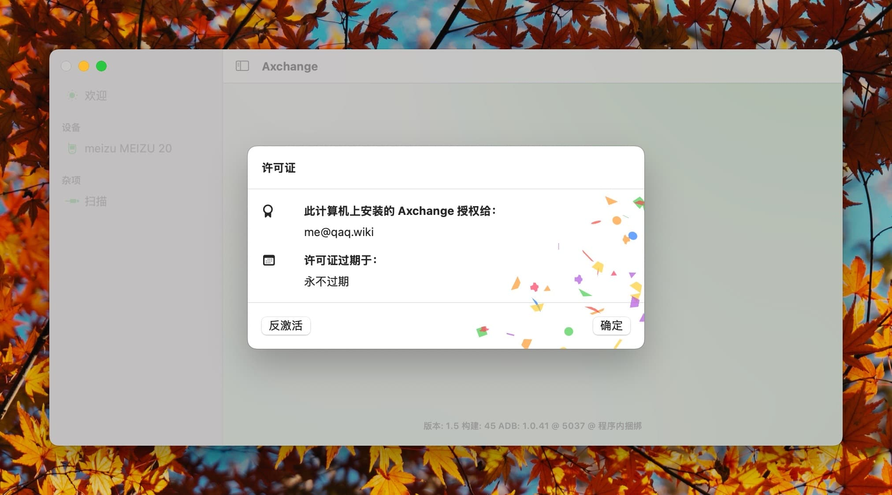

# 激活软件

**不在 App Store 下载的 Axchange 需要激活才能使用。**

若你已从 App Store 购买 Axchange，则可以跳过本章的内容。

## 购买

有两种方式可以获取 Axchange 的许可证：

- https://www.creem.io/payment/prod_6Bht6EjCLseON5xihxtUzN (国际卡)
- https://lizhi.shop/site/products/id/791 (微信、支付宝等)

## 试用

在激活前，你可以试用大约 7 天的时间。无须任何操作即可使用软件的全部功能。此时，在激活页面，点击 `继续试用` 即可。

> 请注意：试用过程中若更改了系统时间，试用可能会提前结束。

## 购买

你可以从授权经销商处购买激活码。请参考 [官方合作伙伴的页面](../lizhi/) 以获取更多信息。

**请注意：数字许可证一旦使用，将不可退款。**

## 激活

若你已购买激活码，可以在软件中激活。如果激活页面没有自动打开，你可以在菜单栏的 `许可证` 选项卡中通过点击 `激活...` 打开。

请在此页面填写邮箱和激活码，并手动点击 `激活`。激活过程需要使用互联网连接。

- 激活完成后，只要不使用 `反激活` 功能，便可离线使用。

## 反激活

反激活会将激活码从当前设备上移除，请仅在设备出售或不再使用时使用此功能。

> 请注意：反激活不会解除或宽限激活码的数量限制。

## 激活码数量限制

对于单个激活码，你可在多台设备上使用。

**请注意：单个激活码只能在单一用户合理数量的设备上激活。**

过多的激活请求将导致激活码被封禁，封禁将由人工审核并操作。

`此上限为一年内不超过 5 台设备，或 10 次激活请求。`
