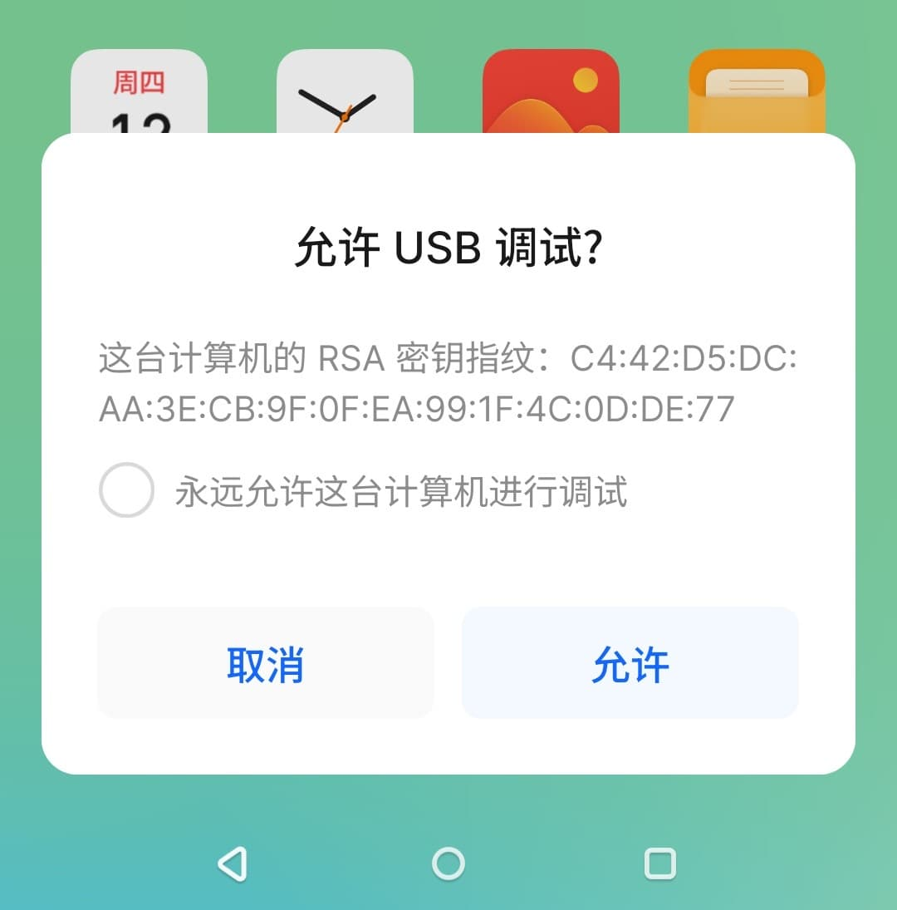
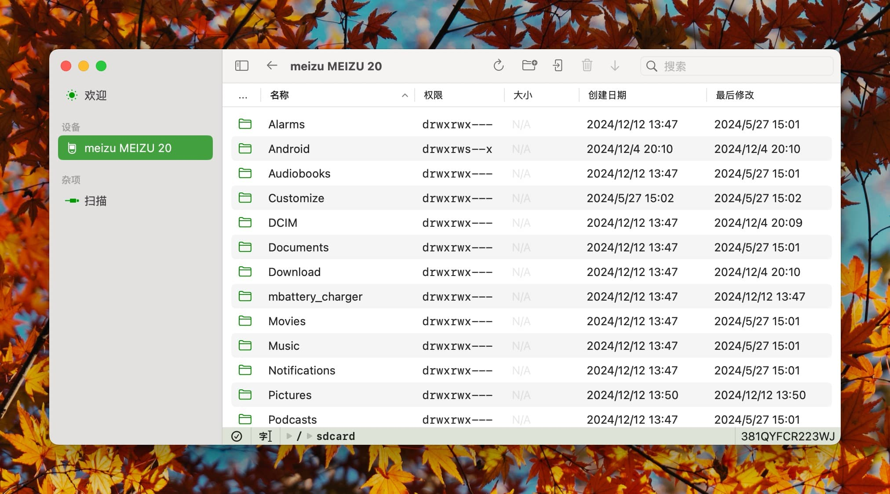
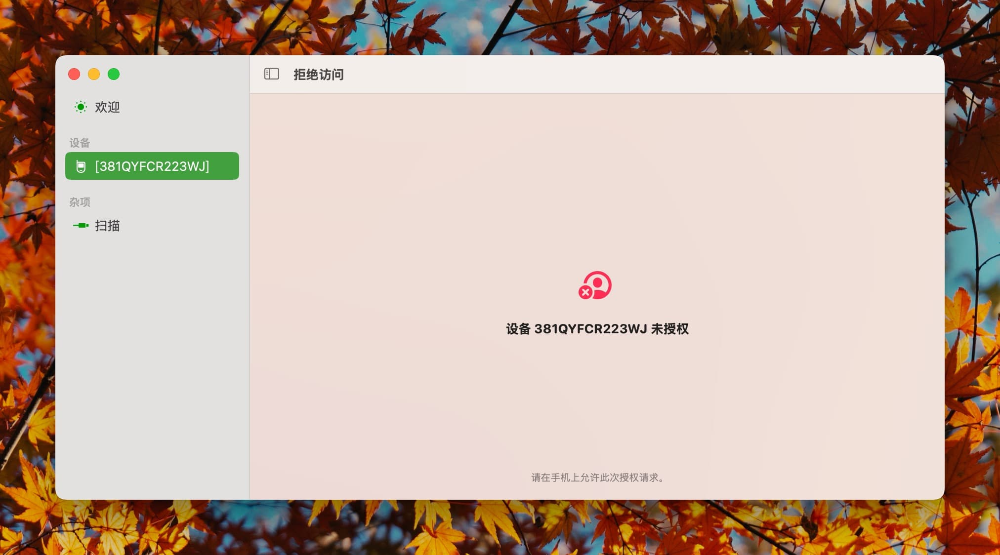

# 在设备上启用 ADB

## 启用 ADB

请通过查阅 [谷歌的文档](https://developer.android.com/studio/debug/dev-options#enable) 以便在设备上启用 ADB。

请参考 `在您的设备上启用 USB 调试` 部分的内容。你必须在设备上启用该功能，才能在计算机上访问设备。

## 授权访问

通常来说，在设备连接到计算机时，会自动弹出对话框询问是否允许连接到设备，如下图所示。如果没有弹出此对话框，则可能是已经拒绝了访问。对于大多数设备，断开与计算机的连接后重新连接，便可再次出现授权提示。

- 部分设备可能会要求输入密码，请根据设备提示操作。



此时，推荐在设备上勾选 `永远允许这台计算机进行调试`，然后在设备上点击 `确定`。随后，在计算机上的 Axchange 软件左侧点击 `扫描` 来刷新设备状态。你也可以在菜单栏的 `设备` 选项卡中找到这个选项。

- 出于软件稳定性考量，Axchange **不会**自动刷新设备状态。



## 拒绝访问

如果装有 Axchange 的计算机不受设备信任，则会提示拒绝访问。如下图所示。



## 技术信息

**Axchange 兼容使用系统已安装的 ADB。**

如果在启动 Axchange 时，ADB 端口 `5037` 已经有其他程序占用，且响应 ADB 查询请求，则不会启动应用程序内捆绑的 ADB 服务。 否则，会尝试在 `5037` 端口启动 ADB 服务。

因此，对于不同的 ADB 服务，Axchange 将在不同的位置储存授权信息。

对于应用程序内捆绑的 ADB 服务，你的授权信息将被储存在应用程序的容器内。位置如下。

```
~/Library/Containers/wiki.qaq.Axchange/Data/.android/adbkey
~/Library/Containers/wiki.qaq.Axchange/Data/.android/adbkey.pub
```

对于此计算机上其他位置提供的 ADB 服务，你的授权信息通常将被储存在此 ADB 服务对应的家目录中。

```
~/.android/adbkey
~/.android/adbkey.pub
```

**但不论情况如何，均需要在设备上授权，才可访问设备。**
